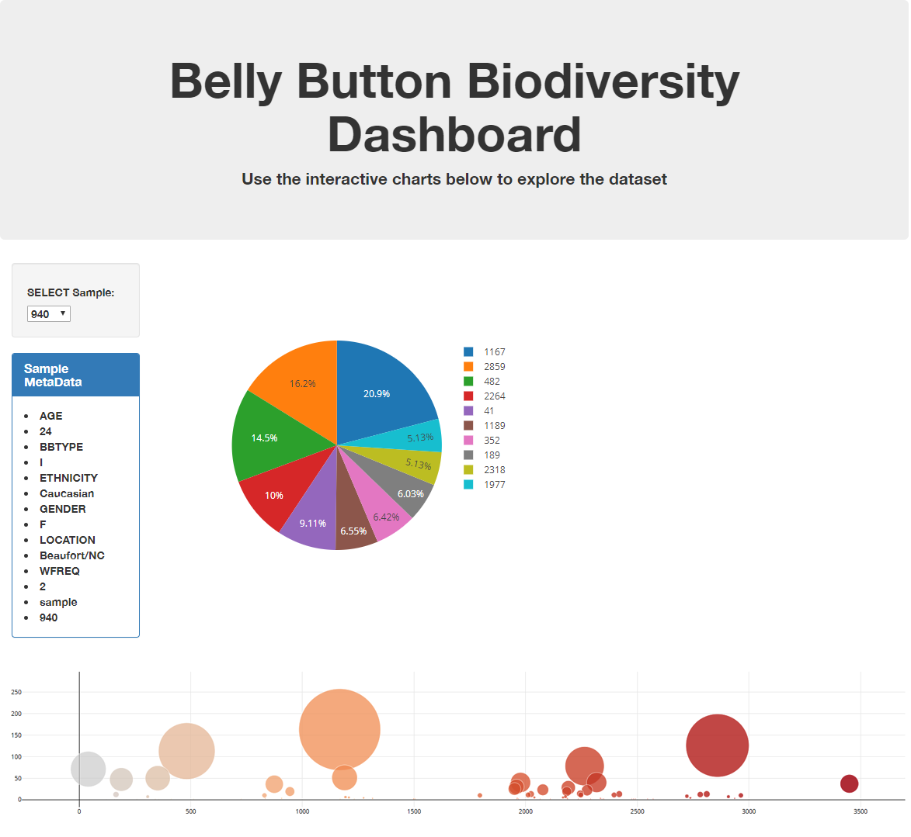

# Biodiversity
In this project I will be building an interactive dashboard about the Biodiversity in the human belly button with multiple charts and visualizations.
I will then deploy the dashboard through Heroku so others can view it.
Using the data on the Biodiversity of a human belly button that I have aquired, I created a web application in html and D3 that displays multiple charts that a user can choose from. I have also deployed this web application through Heroku and the link to the site can be found below.
https://belly-button-diversity-mp.herokuapp.com/

